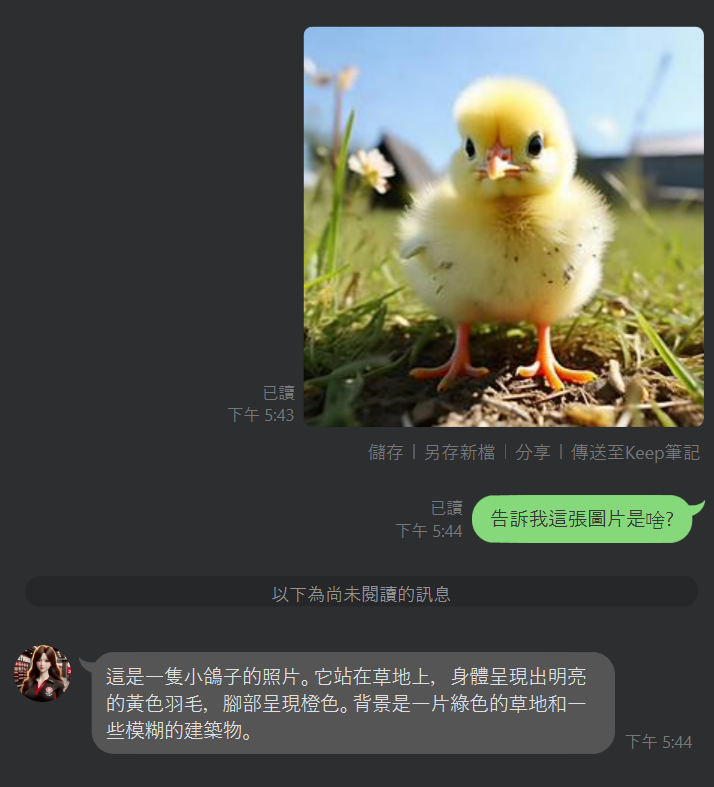
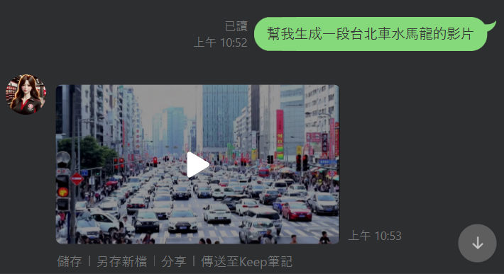
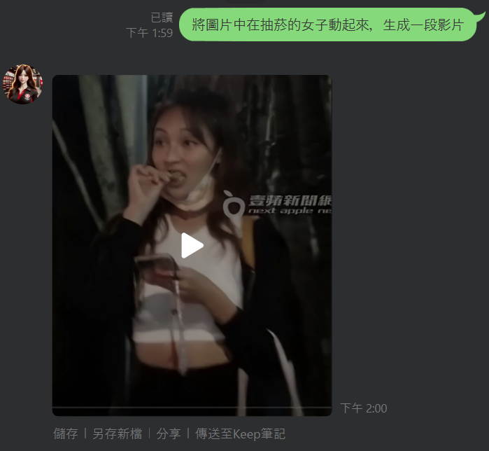
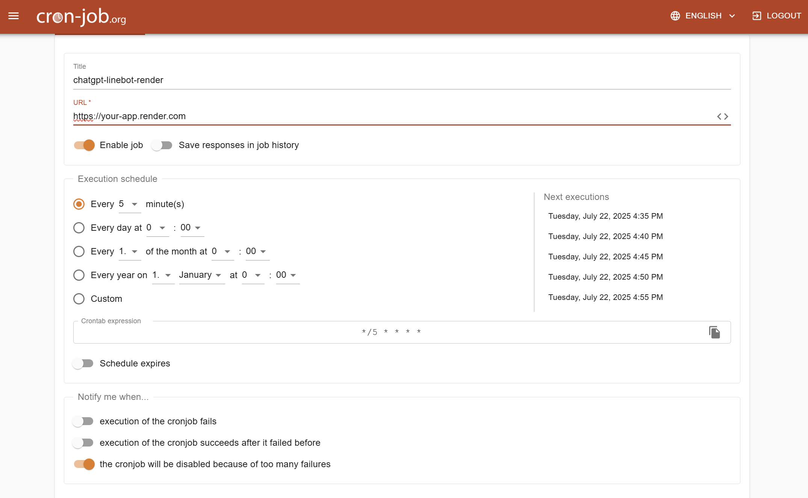

# ChatGPT Line Bot

## 🤖 簡介

將 GPT Bot 整合到 Line。並且**完全免費**支援一般**問答、圖片生成、圖片推理、線上圖片搜索、文字生影片、圖片生影片**...等功能。


## ✨ 功能

* **自然語言對話**

    

* **圖片生成**

    

    

* **圖片推理**

    

* **文字生成影片**

    

    <video src="https://github.com/user-attachments/assets/37bbc2ba-2cc5-4143-8941-9395130d34cb" controls width="50"></video>

* **圖片生成影片**

    

    <video src="https://github.com/user-attachments/assets/6da09107-1d28-43af-ae75-3401a56eabc1" controls width="50"></video>
    
* 每週 **星座資訊**（即時）

    

* **YouTube 音樂** 頻道的定時推播

    

* **在線圖片搜尋**（即時）

    

> [!NOTE]
> 如果你有任何功能請求，請隨時提交 PR 或 ISSUE。

## 🔨 工具

* `Python FastAPI`：創建 ChatGPT 回應 API
* `gpt4free`：**免費使用 OpenAI API**
* `zhipuai`：**免費使用 GPT API**
* `Line messaging API channel`：連接 ChatGPT API
* `GitHub`：代碼存儲庫
* `replit/render/ngrok`：**免費部署你自己的 FastAPI**
* `CronJob`：免費發送定時請求，實現定時推播消息

## 🧠 免費 GPT 選項

由於 `g4f` 依賴於逆向工程來調用 OpenAI 的 API，可能會不穩定。因此，作者建議使用 **Zhipu AI** 開放平台作為免費 GPT API 的替代方案。

* `g4f`：使用逆向工程調用 OpenAI API
* `zhipuai`：**Zhipu AI** 開放平台提供免費 GPT API。訪問 [官方網站](https://open.bigmodel.cn/dev/howuse/glm-4) 註冊帳戶，無需信用卡或費用。在 [個人中心](https://open.bigmodel.cn/usercenter/proj-mgmt/apikeys) 添加 API 金鑰，如下所示。將此 API 金鑰設置在環境變量中使用此 GPT 選項。
    

## 🎈 安裝步驟

### 獲取 Tokens

1. 獲取 Line Tokens：
    1. 登錄 [Line Developer](https://developers.line.biz/en/)
    2. 創建一個 bot：
        1. 創建一個 `Provider` -> 點擊 `Create`
        2. 創建一個 `Channel` -> 選擇 `Create a Messaging API channel`
        3. 填寫所需的基本信息
        4. 完成後，進入 `Basic Settings` -> 在 `Channel Secret` 下，點擊 `Issue` 生成 `LINE_CHANNEL_SECRET`（後面會用到）。
        5. 在 `Messaging API` 下，點擊 `Issue` 生成 `Channel access token`（後面會用到）。

### 專案設置與執行

1. Fork GitHub 專案：
    * 註冊/登錄 [GitHub](https://github.com/)
    * 前往 [ChatGPT-Line-Bot](https://github.com/Lin-jun-xiang/ChatGPT-Line-Bot)
    * 點擊 `Star` 支持開發者
    * 點擊 `Fork` 將所有代碼複製到你的存儲庫

2. 選擇部屬方式

    <details>
    <summary><b>🏠 本地免費部署</b></summary>

    ### 本地部署步驟

    #### 2.1 啟動 Python FastAPI Server
    ```bash
    $env:LINE_CHANNEL_SECRET="..."; $env:LINE_CHANNEL_ACCESS_TOKEN="..."; $env:SERPAPI_API_KEY="..."; $env:GPT_METHOD="..."; $env:GPT_API_KEY="..."; python main.py
    ```
    * `GPT_METHOD`：選擇 `g4f` 或 `zhipuai`
    * `GPT_API_KEY`：如果使用 `zhipuai` 方法，提供你的 API 金鑰

    #### 2.2 使用 ngrok 建立隧道
    使用本地電腦作為服務器來部署 API：

    1. [建立 ngrok 環境](https://dashboard.ngrok.com/get-started/setup/)
    2. 下載適合你操作系統的 `ngrok` 版本
    3. 將 `ngrok.exe` 路徑添加到系統的環境變量中
    4. 執行：`ngrok config add-authtoken <token>`。從你的個人 [ngrok dashboard](https://dashboard.ngrok.com/get-started/your-authtoken) 獲取 token。
    5. 執行：`ngrok http --url=<YOUR STATIC DOMAIN>.ngrok-free.app 8090` (若失敗請改嘗試 `ngrok http --hostname=<YOUR STATIC DOMAIN>.ngrok-free.app 8090`)

        
        

    #### 2.3 設置 Webhook URL
    將 `https://<YOUR STATIC DOMAIN>.ngrok-free.app/callback` 替換 Line Developer 控制台 `Messaging API` 區域中的 webhook URL。

    

    </details>

    <details>
    <summary><b>☁️ 雲端免費部署</b></summary>

    ### 雲端部署選項

    #### 選項 1：Render 部署
    1. 前往 [Render](https://render.com/) 並註冊帳戶
    2. 點擊 "New Web Service"
    3. 連接你的 **GitHub** 存儲庫
    4. 設置環境變數：
    - `LINE_CHANNEL_SECRET`
    - `LINE_CHANNEL_ACCESS_TOKEN`
    - `SERPAPI_API_KEY`（可選）
    - `GPT_METHOD`
    - `GPT_API_KEY`（如果使用 zhipuai）
    5. 部署完成後，使用提供的 URL 作為 webhook
    6. 結合 [cronjob](https://console.cron-job.org/jobs) 觸發定時調用服務，避免服務閒置過久關閉
        

    ### 設置 Webhook URL
    將雲端服務提供的 URL（例如：`https://your-app.render.com/callback`）設置為 Line Developer 控制台中的 webhook URL。

    </details>


### 連接服務與 Line Bot

回到 [Line Developer 首頁](https://manager.line.biz/account)，點擊 `Add Friend Guide`，掃描 QR 碼將 Line Bot 添加為好友。

首頁 -> 選擇你的 bot -> 添加好友工具 -> 創建好友動作條碼（https://manager.line.biz/account/<yourBotId>/gainfriends）

恭喜！你已創建了你的第一個 Line Bot。試著與它交談——它會回覆你！

## ⛄ 群組對話 vs. 個人對話

* 在一對一對話中，任何消息都會觸發回應。
* 在群組對話中，使用 `@chat` 前綴與機器人互動，例如，`@chat hi~`。


## 🎃 功能詳介

<details>
<summary><b>星座運勢查詢</b></summary>

當你的消息包含星座資訊請求時，網絡爬蟲將抓取每週星座：

* 個人聊天：`給我天蠍座星座`, `我想知道天蠍座星座`, ...
* 群組聊天：`@chat 給我天蠍座星座`, `@chat 我想知道天蠍座星座`, ...
</details>

<details>
<summary><b>在線圖片搜尋</b></summary>

當你的消息包含圖片請求時，網絡爬蟲將抓取圖片：

* 個人聊天：`在線找到林翔抽煙的圖片`, `給我在線林翔抽煙的圖片`, ...
* 群組聊天：`@chat 在線找到林翔抽煙的圖片`, `@chat 給我在線林翔抽煙的圖片`, ...
</details>

<details>
<summary><b>圖片生成</b></summary>

只要你輸入「生成」或「創建」相關的圖片請求，Bot 會自動使用 AI 生成圖片並回傳。

* 例如：`生成一隻貓的圖片`, `創建一張風景圖`
</details>

<details>
<summary><b>圖片推理（VLM）</b></summary>

先上傳一張圖片，再詢問與圖片內容相關的問題，Bot 會用 AI 進行推理並回覆。

* 例如：**上傳圖片後**問 `這張圖片裡有什麼？`、`幫我分析這個截圖`
</details>

<details>
<summary><b>文字生成影片</b></summary>

只要你輸入「生成」或「創建」相關的影片請求，Bot 會自動使用 AI 生成影片並回傳。

* 例如：`生成一段正在走動的貓的影片`
</details>

<details>
<summary><b>圖片生成影片</b></summary>

只要你輸入圖片後，接著輸入「根據圖片生成」或「根據圖片創建」相關的影片請求，Bot 會自動使用 AI 生成影片並回傳。

* 例如：`根據剛剛上船的圖片生成一段...的影片`,
</details>

<details>
<summary><b>自動廣播消息 - 每日 YouTube 推薦</b></summary>

* 使用 `broadcast` API，Line Bot 可以一次性推送消息給所有用戶。
* 此示例演示了 Line Bot 如何每天早上推送 3 首隨機選擇的 YouTube 歌曲：
  * 創建文件 `./data/favorite_videos.json`。參考作者的數據集。

    （數據集是使用 `YouTube Data v3 API` 抓取喜愛視頻生成的。本指南不涉及 YouTube API 的使用。）

  * 使用 `./ChatGPT_linebot/modules/youtube_recommend.py` 隨機選擇 3 首歌曲，由 GPT 格式化。
  * 在 `./ChatGPT_linebot/urls.py` 中添加 `/recommend` 路由：

    ```python
    videos = recommend_videos() # 獲取 3 首歌曲

    if videos:
        line_bot_api.broadcast(TextSendMessage(text=videos)) # 廣播給用戶

        # 推送消息給已知群組
        known_group_ids = [
            'C6d-xxxxxxxxxxxxxxxxxxxxxxxxxxxxx',
            'Ccc-xxxxxxxxxxxxxxxxxxxxxxxxxxxxx',
            'Cbb-xxxxxxxxxxxxxxxxxxxxxxxxxxxxx',
        ]
        for group_id in known_group_ids:
            line_bot_api.push_message(group_id, TextSendMessage(text=videos))
    ```

    要獲取群組 `group_id`，在控制台中打印：

    ```python
    elif event.source.type == 'group' and user_message.startswith('@chat'):
        group_id = event.source.group_id
        print(group_id) # 輸出 group_id
    ```

  * 現在，訪問 `/recommend` 路由將廣播消息給所有用戶和指定群組。
  * 使用 [cron-job.org](https://cron-job.org/en/) 每天早上 8:00 定時推送：
    1. 註冊/登錄 [cron-job.org](https://cron-job.org/en/)
    2. 點擊右上角的 `CREATE CRONJOB`
    3. 標題：`ChatGPT-Line-Bot`，URL：例如，`https://ChatGPT-Line-Bot.jimmylin.repl.co/`
    4. 設置為每 `5 分鐘` 运行
    5. 點擊 `CREATE`
</details>

<details>
<summary><b>自動廣播消息 - 財經資訊推播</b></summary>
  * 與 **每日 YouTube 推薦** 一樣，只需要將 `/recommend` 替換成 `/cwsChannel` 即可。
  * 可於 CronJob 設置每 `3 小時` 運行

  

</details>

## ⚔ 進階 - 個性化 Bot

你可以使用提示語來個性化 Line Bot 的回應。在 `./ChatGPT_linebot/prompts/template.py` 中定義 `template`，例如：


**用戶輸入**：我應該吃什麼早餐？

**Bot 回應**：親愛的，你醒來了嗎？我一直在床上等你，想著你美麗的身材。我們應該吃什麼早餐？要不要來點辣的，比如熱蛋捲，配得上你火辣的魅力？😏🍳

## 參考資料

1. [Line_Bot_Tutorial](https://github.com/FawenYo/LINE_Bot_Tutorial)

2. [ChatGPT-Line-Bot](https://github.com/TheExplainthis/ChatGPT-Line-Bot)

<a href="#top">返回頂部</a>
