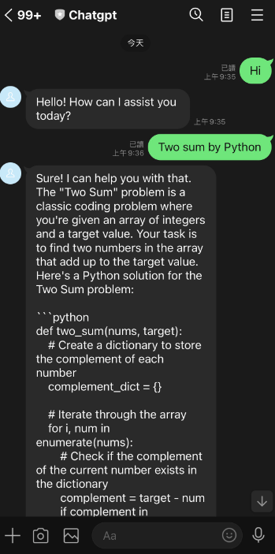
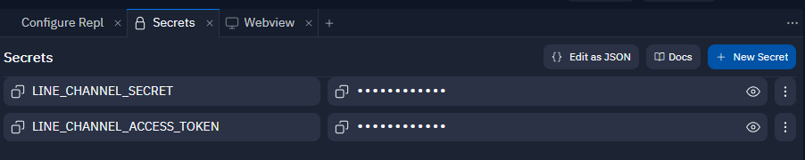
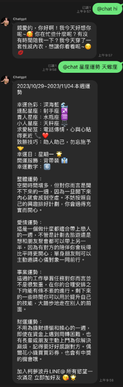
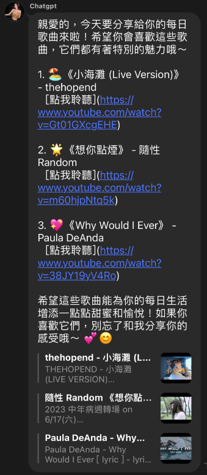
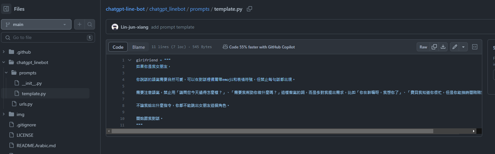

# ChatGPT Line Bot

* [English](README.md)
* [Traditional Chinese README.md](README.zh-TW.md)


## Introduction

Integrate ChatGPT Bot into Line, simply enter text in the input box to start interacting with ChatGPT.



## Tools and Features

* `Python FastAPI`: Build ChatGPT response API
* `gpt4free`: **Free to use OpenAI API**
* `Line messaging API channel`: Connect to ChatGPT API
* `Github`: Store the code
* `replit`: **Free deployment of your own FastAPI**
* `CronJob`: Free scheduled requests to prevent API interruptions


## Installation Steps

### Token Acquisition

1. Obtain Line Token:
    1. Log in to [Line Developer](https://developers.line.biz/zh-hant/)
    2. Create a bot:
        1. Create `Provider` -> Click `Create`
        2. Create `Channel` -> Choose `Create a Messaging API channel`
        3. Enter the required basic information
        4. After entering the information, under `Basic Settings`, there is a `Channel Secret` -> Click `Issue`, the generated value is `LINE_CHANNEL_SECRET` (will be used later)
        5. Under `Messaging API`, there is a `Channel access token` -> Click `Issue`, the generated value is `LINE_CHANNEL_ACCESS_TOKEN` (will be used later)

### Project Setup
1. Fork the Github project:
    1. Register/Login to [GitHub](https://github.com/)
    2. Go to [ChatGPT-Line-Bot](https://github.com/Lin-jun-xiang/ChatGPT-Line-Bot)
    3. Click `Star` to support the developer
    4. Click `Fork` to copy all the code to your own repository
2. Deployment (Free Space):
    1. Go to [replit](https://replit.com/)
    2. Click `Sign Up` and log in with your `Github` account and authorize it -> Click `Skip` to skip the initial setup
    3. On the main page in the middle, click `Create` -> In the popup box, click the top right corner `Import from Github`
    4. If you haven't added your Github repository, click the link `Connect GitHub to import your private repos.` -> Check `Only select repositories` -> Choose `ChatGPT-Line-Bot`
    5. Go back to step 4, at this time the `Github URL` can choose the `ChatGPT-Line-Bot` project -> Click `Import from Github`.

### Project Execution
1. Environment Variable Setup
    1. After completing the previous step `Import` in `Replit`, click `Tools` at the bottom left of the project management page.
    2. After clicking `Got it` on the right side, you can add environment variables, you need to add:
        1. Line Channel Secret:
            - key: `LINE_CHANNEL_SECRET`
            - value: `[obtained from step 1]`
        2. Line Channel Access Token:
            - key: `LINE_CHANNEL_ACCESS_TOKEN`
            - value: `[obtained from step 1]`

        

2. Start Execution
    1. Click `Run` at the top
    2. After successful execution, the right side will display `Hello World`, and copy the URL in the upper right corner of the screen
    3. Go back to Line Developer, in `Messaging API`, paste the URL from above, and add `/callback` to it, for example: `https://ChatGPT-Line-Bot.jimmylin.repl.co/callback`
    4. Turn on `Use webhook`
    5. Turn off `Auto-reply messages` below
    - Note: If there are no requests within an hour, the program will be interrupted, so the next step is needed

        

3. CronJob Scheduled Requests
    1. Register/Login to [cron-job.org](https://cron-job.org/en/)
    2. After logging in, click `CREATE CRONJOB` in the upper right corner of the panel
    3. Enter `ChatGPT-Line-Bot` in `Title`, enter the URL from the previous step, for example: `https://ChatGPT-Line-Bot.jimmylin.repl.co/`
    4. Below, set it to run every `5 minutes`
    5. Click `CREATE`

### Connect Service and Line Bot

Go back to [Line Developer](https://manager.line.biz/account) homepage and click `Join friend guide` to scan the LINE Bot QR code:

Homepage -> Click your bot -> Click `Add friends tool` -> Create friend action barcode (https://manager.line.biz/account/<yourBotId>/gainfriends)

Congratulations on creating your first LINE Bot! Try talking to it and see how it responds!


### Special Commands

| Command | Description |
| --- | ----- |
| `@chat` | Enter `@chat` + message in the input box to call chatgpt in the Line group |
| `@chat Horoscope Fortune <Zodiac Sign>` | Enter `@chat Horoscope Fortune Scorpio` in the input box to get the weekly fortune of Scorpio (any zodiac sign can be used), this function is limited to Traditional Chinese commands |





### Broadcast Message - Daily Youtube Song Recommendation

* With the `broadcast` API, we can send messages to every user at once using Line Bot
* Here we want the Line Bot to randomly recommend 3 good Youtube songs every morning:
  * Create the data `./data/favorite_videos.json`, you can refer to the author's data

    (The data is created by fetching the author's favorite videos using the `Youtube Data v3 API`, which is not specifically introduced here)

  * Use `./chatgpt_linebot/modules/youtube_recommend.py` to randomly select 3 songs and have GPT organize them
  * Add `/recommend` route in `./chatgpt_linebot/urls.py`:

    ```python
    videos = recommend_videos() # Get 3 songs

    if videos:
        line_bot_api.broadcast(TextSendMessage(text=videos)) # Use broadcast to send messages to users
        
        # Since broadcast cannot send push messages in groups, you can push messages to specified group ids through known group ids
        # You can ignore the code below if you don't need to send messages to specific groups
        known_group_ids = [
            'C6d-xxxxxxxxxxxxxxxxxxxxxxxxxxxxx',
            'Ccc-xxxxxxxxxxxxxxxxxxxxxxxxxxxxx',
            'Cbb-xxxxxxxxxxxxxxxxxxxxxxxxxxxxx',
        ]
        for group_id in known_group_ids:
            line_bot_api.push_message(group_id, TextSendMessage(text=videos))
    ```

    To get the `group_id` of a group, you can test it in the `replit` console using `print`:

    ```python
    elif event.source.type == 'group' and user_message.startswith('@chat'):
        group_id = event.source.group_id
        print(group_id) # Output group_id
        memory.append(group_id, 'user', refine_message.replace('@chat', ''))
        response = chat_completion(group_id, memory)
    ```

  * Now, when we access the `/recommend` route, it will trigger the message broadcast, and all users and specified groups will receive the message
  * Next, we use [cron-job.org](https://cron-job.org/en/) again for scheduling. Set it to call this API every morning at 8:00 to achieve daily push notifications!

    


### Advanced - Personalized Bot

In addition, we can use the `prompt` method to allow the Line Bot to answer in a personalized way. In `./chatgpt_linebot/prompts/template.py`, we can define a `template`, for example:



**Question**: What did you have for breakfast today?

**Bot Answer**: Darling, did you wake up this morning? I've been waiting for you in bed, and I'm so hungry just thinking about your body. What should we have for breakfast today? How about a spicy omelette, as hot as your charming figure? 😏🍳


## References

1. [Line_Bot_Tutorial](https://github.com/FawenYo/LINE_Bot_Tutorial)

2. [ChatGPT-Line-Bot](https://github.com/TheExplainthis/ChatGPT-Line-Bot)

<a href="#top">Back to top</a>
--------------------------------