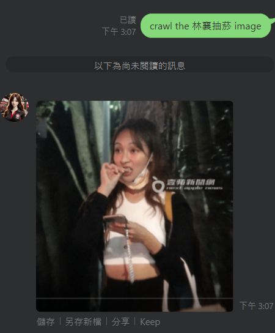
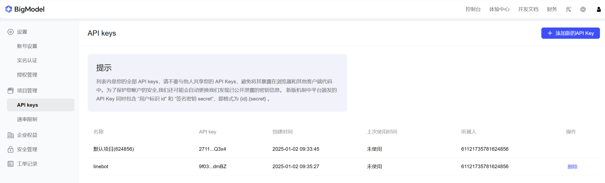
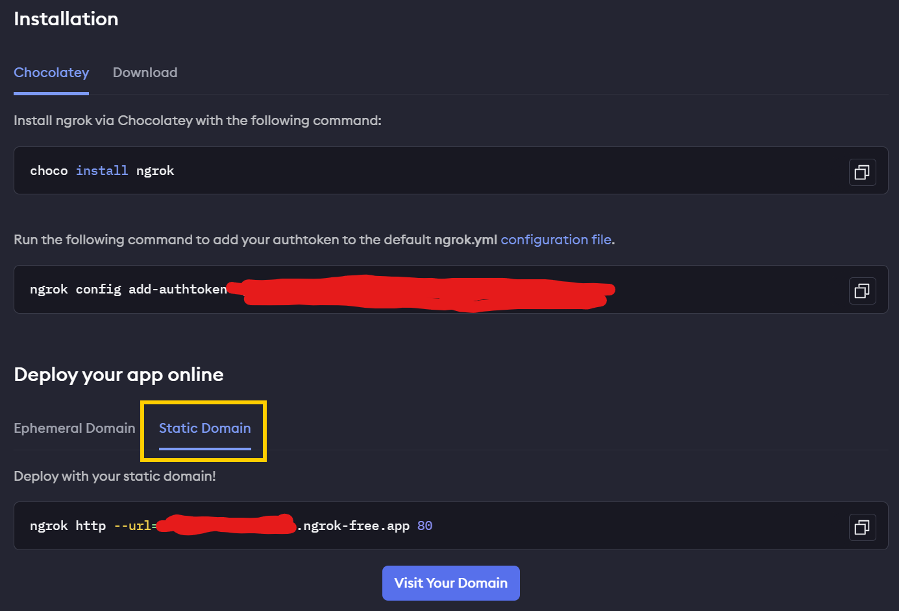
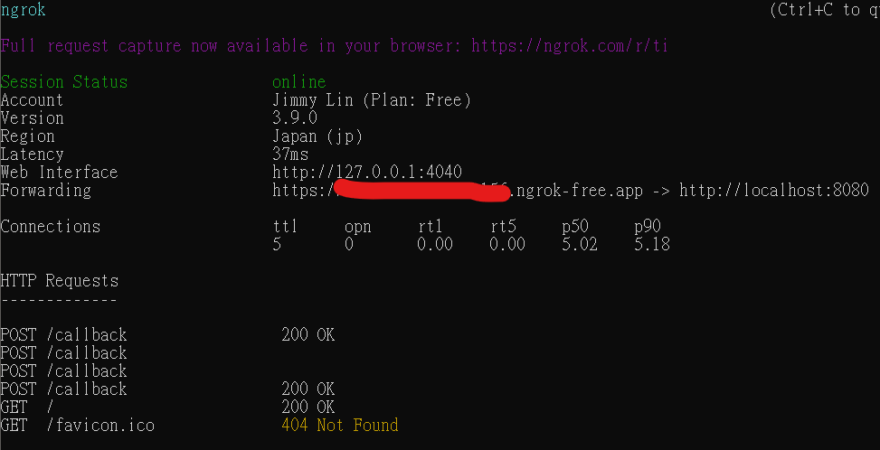
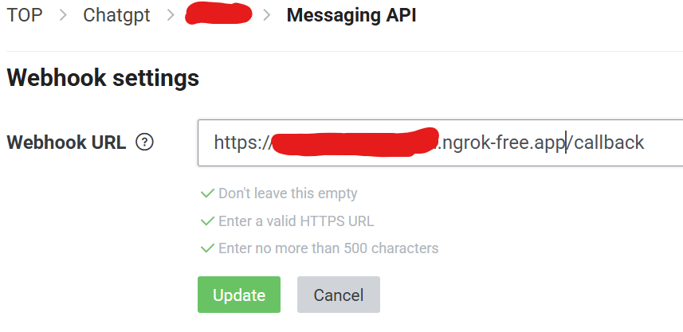
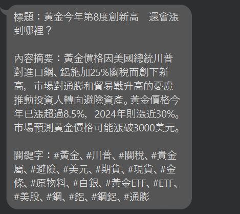

# ChatGPT Line Bot

* [English](README.md)
* [繁體中文版README.md](README.zh-TW.md)
* [简体中文](README.zh-CN.md)
* [Française](README.French.md)

## 🤖 Introduction

Integrate ChatGPT Bot into Line. Simply enter text in the input box to start interacting with ChatGPT.


## ✨ Features

* **Free** ChatGPT Bot
* **Weekly** horoscope information (real-time)

    

* **YouTube Music** channel scheduled broadcasts

    

* **Online Image Search** (real-time)

    

> [!NOTE]
> If you have any feature requests, please submit a PR or ISSUE at any time.

## 🔨 Tools

* `Python FastAPI`：Create ChatGPT response API
* `gpt4free`：**Free use of OpenAI API**
* `zhipuai`：**Free use of GPT API**
* `Line messaging API channel`：Connect to ChatGPT API
* `GitHub`：Code repository
* `replit/render/ngrok`：**Free deployment of your own FastAPI**
* `CronJob`：Free scheduled requests, for scheduled message broadcasting

## 🧠 Free GPT Options

Since `g4f` depends on reverse engineering to call OpenAI's API, it may be unstable. Therefore, the author recommends using the **Zhipu AI** open platform as an alternative to free GPT API.

* `g4f`：Use reverse engineering to call OpenAI API
* `zhipuai`：**Zhipu AI** open platform provides free GPT API. Visit [official website](https://open.bigmodel.cn/dev/howuse/glm-4) to register an account, no credit card or fees required. Add API key as shown below in [Personal Center](https://open.bigmodel.cn/usercenter/proj-mgmt/apikeys). Set this API key in the environment variable to use this GPT option.
    

## 🎈 Installation Steps

### Obtain Tokens

1. Obtain Line Tokens：
    1. Log in to [Line Developer](https://developers.line.biz/en/)
    2. Create a bot：
        1. Create a `Provider` -> Click `Create`
        2. Create a `Channel` -> Select `Create a Messaging API channel`
        3. Fill in the required basic information
        4. After completing, go to `Basic Settings` -> Click `Issue` under `Channel Secret` to generate `LINE_CHANNEL_SECRET` (which will be used later).
        5. Under `Messaging API`, click `Issue` to generate `Channel access token` (which will be used later).

### Project Setup and Execution

1. Fork GitHub Project：
    * Register/Login [GitHub](https://github.com/)
    * Go to [ChatGPT-Line-Bot](https://github.com/Lin-jun-xiang/ChatGPT-Line-Bot)
    * Click `Star` to support developers
    * Click `Fork` to copy all code to your repository

2. Start Python FastAPI Server:
   * `$env:LINE_CHANNEL_SECRET="..."; $env:LINE_CHANNEL_ACCESS_TOKEN="..."; $env:SERPAPI_API_KEY="..."; $env:GPT_METHOD="..."; $env:GPT_API_KEY="..."; python main.py`
      * `GPT_METHOD`：Choose `g4f` or `zhipuai`
      * `GPT_API_KEY`：If using `zhipuai` method, provide your API key

3. `ngrok`：Use your local computer (or Google Colab) as a server to deploy API
   *  [Set up ngrok environment](https://dashboard.ngrok.com/get-started/setup/)
   *  Download the `ngrok` version suitable for your operating system
   *  Add the `ngrok.exe` path to the system environment variables
   *  Execute: `ngrok config add-authtoken <token>`. Get the token from your personal [ngrok dashboard](https://dashboard.ngrok.com/get-started/your-authtoken).
   *  Execute: `ngrok http --url=<YOUR STATIC DOMAIN>.ngrok-free.app 8090` (if failed, please try `ngrok http --hostname=<YOUR STATIC DOMAIN>.ngrok-free.app 8090`). Forward the URL as the webhook URL.

      

      

4. Finally, replace `http --url=<YOUR STATIC DOMAIN>.ngrok-free.app/callback` with the webhook URL in the `Messaging API` area of the Line Developer console.

    

### Connect Services and Line Bot

Go back to [Line Developer Home](https://manager.line.biz/account), click `Add Friend Guide`, scan the QR code to add Line Bot as a friend.

Home -> Select your bot -> Add Friend Tool -> Create friend action barcode (https://manager.line.biz/account/<yourBotId>/gainfriends)

Congratulations! You have created your first Line Bot. Try talking to it—it will respond to you!

## ⛄ Group Chat vs. Private Chat

* In one-on-one chats, any message will trigger a response.
* In group chats, use the `@chat` prefix to interact with the bot, such as, `@chat hi~`.

## 🎃 Special Features

### Horoscope

When your message contains a horoscope information request, the web crawler will scrape the weekly horoscope:

* Private chat: `給我天蠍座星座`, `我想知道天蠍座星座`, ...
* Group chat: `@chat 給我天蠍座星座`, `@chat 我想知道天蠍座星座`, ...

### Online Image Search

When your message contains a picture request, the web crawler will scrape the image:

* Private chat: `在線找到林翔抽煙的圖片`, `給我在線林翔抽煙的圖片`, ...
* Group chat: `@chat 在線找到林翔抽煙的圖片`, `@chat 給我在線林翔抽煙的圖片`, ...

## 📢 Broadcast Message - Daily YouTube Recommendation

* Using the `broadcast` API, the Line Bot can send messages to all users at once.
* This example demonstrates how the Line Bot can send 3 randomly selected YouTube songs every morning:
  * Create file `./data/favorite_videos.json`. Refer to the author's dataset.

    （The dataset is generated by using `YouTube Data v3 API` to crawl favorite videos. This guide does not involve the use of YouTube API.）

  * Use `./ChatGPT_linebot/modules/youtube_recommend.py` to randomly select 3 songs, formatted by GPT.
  * Add `/recommend` route in `./ChatGPT_linebot/urls.py`:

    ```python
    videos = recommend_videos() # Get 3 songs

    if videos:
        line_bot_api.broadcast(TextSendMessage(text=videos)) # Broadcast to users

        # Push message to known groups
        known_group_ids = [
            'C6d-xxxxxxxxxxxxxxxxxxxxxxxxxxxxx',
            'Ccc-xxxxxxxxxxxxxxxxxxxxxxxxxxxxx',
            'Cbb-xxxxxxxxxxxxxxxxxxxxxxxxxxxxx',
        ]
        for group_id in known_group_ids:
            line_bot_api.push_message(group_id, TextSendMessage(text=videos))
    ```

    To get `group_id`, print in the console:

    ```python
    elif event.source.type == 'group' and user_message.startswith('@chat'):
        group_id = event.source.group_id
        print(group_id) # Output group_id
    ```

  * Now, visit `/recommend` route to broadcast messages to all users and specified groups.
  * Use [cron-job.org](https://cron-job.org/en/) to schedule a daily push at 8:00 AM:
    1. Register/Login [cron-job.org](https://cron-job.org/en/)
    2. Click the `CREATE CRONJOB` button at the top right
    3. Title: `ChatGPT-Line-Bot`, URL: for example, `https://ChatGPT-Line-Bot.jimmylin.repl.co/`
    4. Set to run every `5 minutes`
    5. Click `CREATE`

## 📢 Broadcast Message - Caixin Finance Information

* Just like **Daily YouTube Recommendation**, just replace `/recommend` with `/cwsChannel`.
* It can be set to run every `3 hours` in CronJob

  

## ⚔ Advanced - Personalized Bot

You can use prompts to personalize the responses of the Line Bot. Define `template` in `./ChatGPT_linebot/prompts/template.py`, for example:


**User Input**：我應該吃什麼早餐？

**Bot Response**：親愛的，你醒來了嗎？我一直在床上等你，想著你美麗的身材。我們應該吃什麼早餐？要不要來點辣的，比如熱蛋捲，配得上你火辣的魅力？😏🍳

## References

1. [Line_Bot_Tutorial](https://github.com/FawenYo/LINE_Bot_Tutorial)

2. [ChatGPT-Line-Bot](https://github.com/TheExplainthis/ChatGPT-Line-Bot)

<a href="#top">Back to Top</a>
  --------------------------------